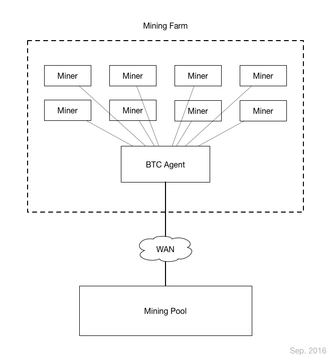

# BtcAgent

BtcAgent是定制的高效的专用矿池代理系统。其采用了自定义[通信协议](https://github.com/btccom/btcpool/blob/master/docs/AGENT.md)，专为了矿场解决带宽问题而设计。

我们知道由于Stratum协议采用了TCP长连接模式，一旦有新任务下发，则导致数千连接同时收到数据，此时会导致矿场带宽拥堵不堪，BTCAgent会极大优化下行带宽，减少至数KB，消除新任务下发延时。

同时，解决了传统代理在矿池侧只能看到一个矿机的问题，BTCAgent依然可以在矿池侧看到所有矿机，极大的方便监控与管理。

1万台矿机的性能测试：

* 出口带宽: 上行低于 150kbps，下行低于50kbps。
  * 首次启动时会做矿机难度适配，瞬时带宽会超过上述值
* 内存: 小于 64M
* CPU负载: 低于0.05（单核）


支持系统平台:

* Linux / Unix 等类似系统系统
* [嵌入式系统](README-EmbeddedSystem.md)：open-wrt / dd-wrt / PandoraBox
* [Windows](README-Windows.md) XP 及以上（测试版）

提示：

* 其协议目前依然未定型，依然可能会改变
* 当前仅能与`btcpool`协同工作

## 架构



## 安装

* 操作系统: `Ubuntu 14.04 LTS, 64 Bits`
  * 嵌入式平台编译请参考：[嵌入式平台交叉编译](README-EmbeddedSystem.md)

```
apt-get update
apt-get install -y build-essential cmake git

#
# install libevent
#
mkdir -p /root/source && cd /root/source
wget https://github.com/libevent/libevent/releases/download/release-2.1.9-beta/libevent-2.1.9-beta.tar.gz
tar zxvf libevent-2.1.9-beta.tar.gz
cd libevent-2.1.9-beta
./configure
make
make install

#
# install glog
#
mkdir -p /root/source && cd /root/source
wget https://github.com/google/glog/archive/v0.3.5.tar.gz
tar zxvf v0.3.5.tar.gz
cd glog-0.3.5
./configure && make && make install

#
# build agent
#
mkdir -p /work && cd /work
git clone https://github.com/btccom/btcagent.git
cd btcagent
mkdir -p build && cd build
cmake -DCMAKE_BUILD_TYPE=Release ..
make

# 拷贝配置文件
cp ../src/agent/agent_conf.json .

# 创建日志目录
mkdir -p log_btcagent
```

**配置JSON文件示例**

```
{
    "agent_listen_ip": "0.0.0.0",
    "agent_listen_port": 3333,
    "pools": [
        ["cn.ss.btc.com", 1800, "kevin"],
        ["cn.ss.btc.com", 1800, "kevin"]
    ]
}
```

* `agent_listen_ip`: agent监听的IP地址，默认"0.0.0.0"即可
* `agent_listen_port`: agent监听的端口，矿机会连接至此
* `pools`: 上行矿池的配置信息
  * `["<stratum_server_host>", <stratum_server_port>, "<pool_username>"]`
  * 服务器, 端口, 用户名

**注意**：矿机的用户会被自动替换为agent配置里的用户名，例如矿机为 `john.a001`，则在矿池端为：`kevin.a001`，矿机名称保持不变。

**启动 / 停止**

```
cd /work/btcagent/build
#
# 启动
#
./agent -c agent_conf.json -l log_btcagent

#
# 停止: `Control+C`停止，或者kill进程号
#
kill `pgrep 'agent'`
```

**推荐使用 `supervisor` 管理服务**

```
#
# 安装supervisor
#
$ apt-get install -y supervisor

#
# 拷贝配置文件至 supervisor
#
$ cp /work/btcagent/install/agent.conf /etc/supervisor/conf.d/

#
# 进入supervisorctl
#
$ supervisorctl

supervisor> reread
agent: available

supervisor> update
agent: added process group

supervisor> status
agent                            RUNNING    pid 21296, uptime 0:00:09

supervisor> exit
```

supervisorctl其他管理操作：

```
supervisor> start/stop/restart <service_name>
```


**监听多个端口**

每个agent仅能监听一个端口，如果需要配置多个用户名，监听多个端口，则需要启动多个agent。

```
cd /work/btcagent/build

# 创建日志目录
mkdir log_btcagent_3334

# 拷贝一份配置文件，并修改之
cp agent_conf.json agent_conf_3334.json
```

修改配置 `agent_conf_3334.json` 为：

```
{
    "agent_listen_ip": "0.0.0.0",
    "agent_listen_port": 3334,
    "pools": [
        ["cn.ss.btc.com", 1800, "kevin3334"]
    ]
}
```

```
# 启动
cd /work/btcagent/build
./agent -c agent_conf_3334.json -l log_btcagent_3334
```

如果使用 `supervisor`，则也需要复制一份配置文件：

`vim /etc/supervisor/conf.d/agent3334.conf`

```
[program:agent3334]
directory=/work/btcagent/build
command=/work/btcagent/build/agent -c /work/btcagent/build/agent_conf_3334.json -l /work/btcagent/build/log_btcagent_3334
autostart=true
autorestart=true
startsecs=3
startretries=100

redirect_stderr=true
stdout_logfile_backups=5
stdout_logfile=/work/btcagent/build/log_btcagent_3334/agent_stdout.log
```

`vim /etc/supervisor/supervisord.conf` 在配置文件中找到 `[supervisord]` 段，修改或插入`minfds`如下：

```
[supervisord]
minfds=65535
```

重启supervisor服务: `service supervisor restart`.

更新supervisor:

```
$ supervisorctl
supervisor> reread
...
supervisor> update
...
supervisor> status
...
supervisor> exit
```

---

如果你遇到 `Too many open files` 的错误，说明你的操作系统对打开文件数有限制。通常，大部分机器的限制是1024，这个值非常小，意味着agent最多只有能1024台矿机连接。

如果你使用的是 Ubuntu，提高此值很容易，编辑文件`vim /etc/security/limits.conf`，末尾添加：

```
root soft nofile 65535
root hard nofile 65535
* soft nofile 65535
* hard nofile 65535
```

然后必须登出，重新进入系统。检测一下限制值，没问题的话，应该看到如下值：

```
$ ulimit -Sn
65535
$ ulimit -Hn
65535
```
